# Firebase MCP Architecture Documentation

## Overview

Firebase MCP is a Model Context Protocol (MCP) server implementation that enables AI assistants to interact directly with Firebase services including Firestore, Storage, and Authentication. This document provides a comprehensive architectural overview of the codebase, including component relationships, data flow, and design patterns.

## Table of Contents

- [Architecture Overview](#architecture-overview)
- [Core Components](#core-components)
- [Firebase Integration](#firebase-integration)
- [Transport Layer](#transport-layer)
- [Tool Implementation](#tool-implementation)
- [Data Flow](#data-flow)
- [Design Patterns](#design-patterns)
- [Security & Error Handling](#security--error-handling)
- [Testing Strategy](#testing-strategy)

## Architecture Overview

The Firebase MCP implementation follows a modular architecture with clear separation between MCP protocol handling, Firebase service integration, and transport mechanisms:

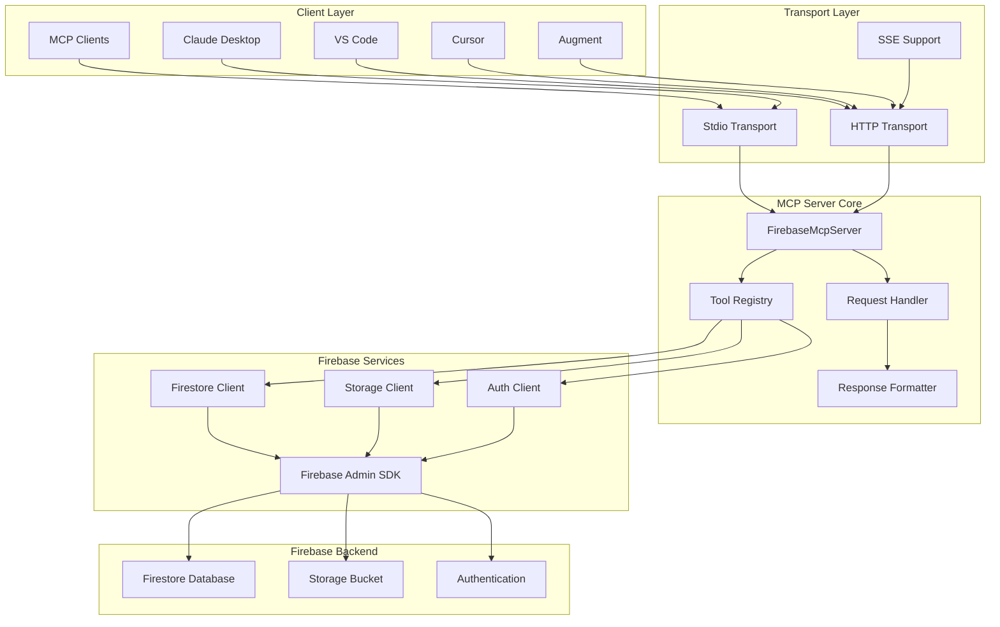
```mermaid
graph TB
    subgraph "Client Layer"
        A[MCP Clients]
        B[Claude Desktop]
        C[VS Code]
        D[Cursor]
        E[Augment]
    end
    
    subgraph "Transport Layer"
        F[Stdio Transport]
        G[HTTP Transport]
        H[SSE Support]
    end
    
    subgraph "MCP Server Core"
        I[FirebaseMcpServer]
        J[Tool Registry]
        K[Request Handler]
        L[Response Formatter]
    end
    
    subgraph "Firebase Services"
        M[Firestore Client]
        N[Storage Client]
        O[Auth Client]
        P[Firebase Admin SDK]
    end
    
    subgraph "Firebase Backend"
        Q[Firestore Database]
        R[Storage Bucket]
        S[Authentication]
    end
    
    A --> F
    B --> F
    C --> G
    D --> G
    E --> G
    
    F --> I
    G --> I
    H --> G
    
    I --> J
    I --> K
    K --> L
    
    J --> M
    J --> N
    J --> O
    
    M --> P
    N --> P
    O --> P
    
    P --> Q
    P --> R
    P --> S
```

## Core Components

### 1. FirebaseMcpServer (`src/index.ts`)

The main server class that orchestrates the entire MCP server functionality:

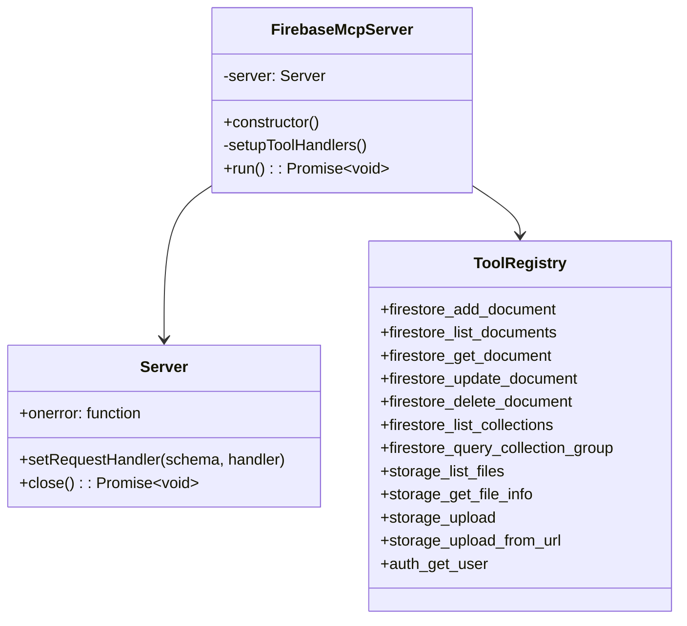
```mermaid
classDiagram
    class FirebaseMcpServer {
        -server: Server
        +constructor()
        -setupToolHandlers()
        +run(): Promise~void~
    }
    
    class Server {
        +setRequestHandler(schema, handler)
        +onerror: function
        +close(): Promise~void~
    }
    
    class ToolRegistry {
        +firestore_add_document
        +firestore_list_documents
        +firestore_get_document
        +firestore_update_document
        +firestore_delete_document
        +firestore_list_collections
        +firestore_query_collection_group
        +storage_list_files
        +storage_get_file_info
        +storage_upload
        +storage_upload_from_url
        +auth_get_user
    }
    
    FirebaseMcpServer --> Server
    FirebaseMcpServer --> ToolRegistry
```

#### Key Features:
- **Tool Registration**: Registers 12 Firebase tools with MCP protocol
- **Request Routing**: Routes tool calls to appropriate Firebase service handlers
- **Error Handling**: Comprehensive error handling with Firebase-specific error messages
- **Response Formatting**: Standardizes responses according to MCP protocol

### 2. Configuration Management (`src/config.ts`)

Centralized configuration handling with environment variable support:

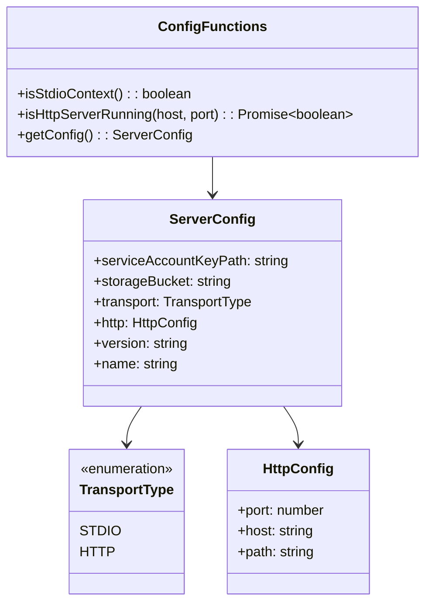
```mermaid
classDiagram
    class ServerConfig {
        +serviceAccountKeyPath: string
        +storageBucket: string
        +transport: TransportType
        +http: HttpConfig
        +version: string
        +name: string
    }
    
    class TransportType {
        <<enumeration>>
        STDIO
        HTTP
    }
    
    class HttpConfig {
        +port: number
        +host: string
        +path: string
    }
    
    class ConfigFunctions {
        +isStdioContext(): boolean
        +isHttpServerRunning(host, port): Promise~boolean~
        +getConfig(): ServerConfig
    }
    
    ServerConfig --> TransportType
    ServerConfig --> HttpConfig
    ConfigFunctions --> ServerConfig
```

#### Configuration Features:
- **Environment Detection**: Automatically detects stdio vs HTTP context
- **Transport Selection**: Supports both stdio and HTTP transports
- **Service Account Management**: Handles Firebase service account configuration
- **Bucket Resolution**: Manages Firebase Storage bucket configuration

### 3. Transport Layer (`src/transports/`)

Dual transport support for different deployment scenarios:

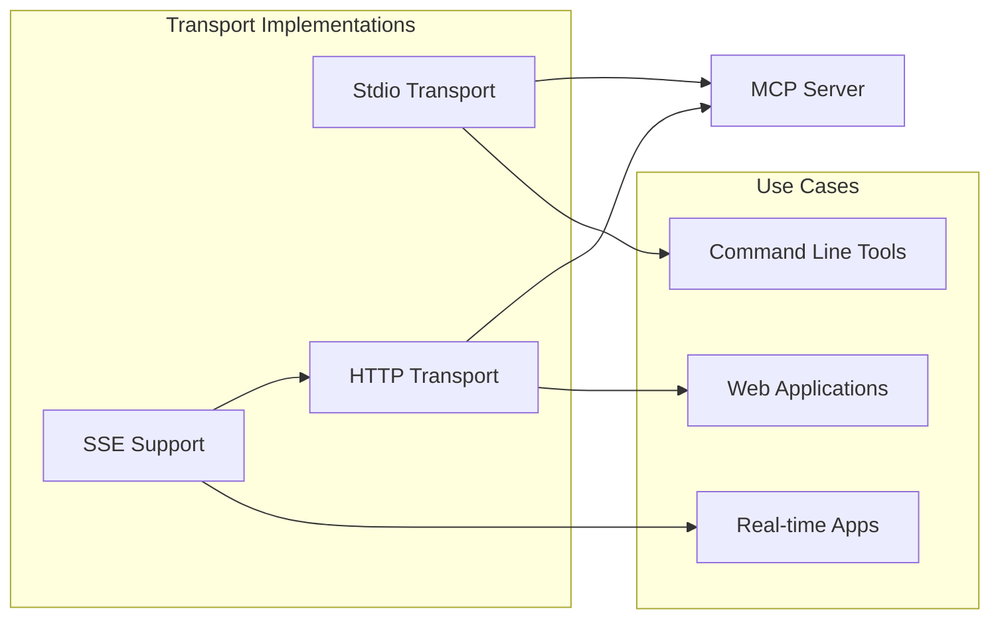
```mermaid
graph LR
    subgraph "Transport Implementations"
        A[Stdio Transport]
        B[HTTP Transport]
        C[SSE Support]
    end
    
    subgraph "Use Cases"
        D[Command Line Tools]
        E[Web Applications]
        F[Real-time Apps]
    end
    
    A --> D
    B --> E
    C --> F
    
    A --> G[MCP Server]
    B --> G
    C --> B
```

#### Transport Features:
- **Stdio Transport**: Process-based communication via stdin/stdout
- **HTTP Transport**: RESTful API over HTTP/HTTPS with Express
- **Session Management**: HTTP transport supports multiple concurrent sessions
- **SSE Support**: Server-Sent Events for real-time notifications

## Firebase Integration

### 1. Firestore Client (`src/lib/firebase/firestoreClient.ts`)

Comprehensive Firestore operations with advanced querying capabilities:

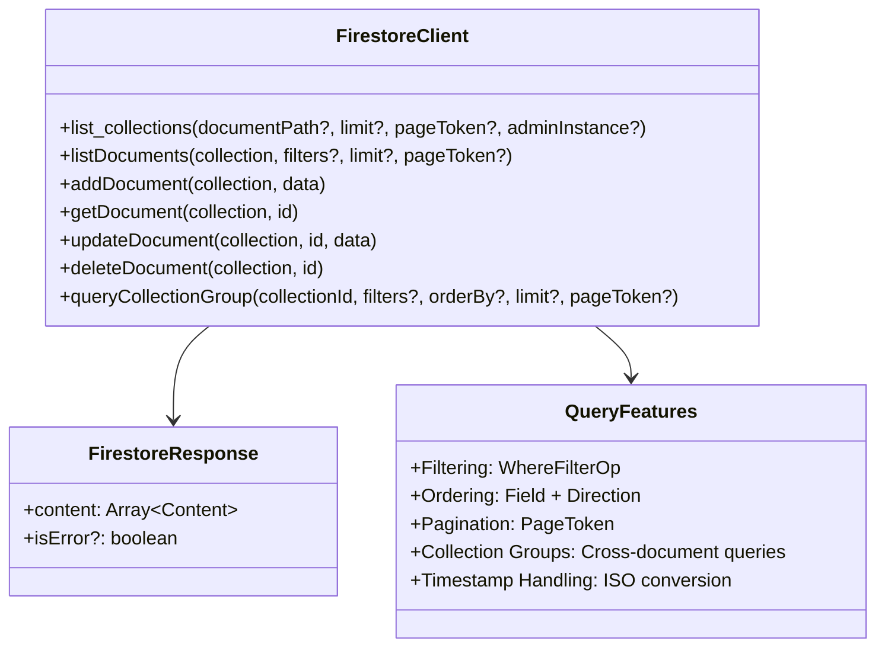
```mermaid
classDiagram
    class FirestoreClient {
        +list_collections(documentPath?, limit?, pageToken?, adminInstance?)
        +listDocuments(collection, filters?, limit?, pageToken?)
        +addDocument(collection, data)
        +getDocument(collection, id)
        +updateDocument(collection, id, data)
        +deleteDocument(collection, id)
        +queryCollectionGroup(collectionId, filters?, orderBy?, limit?, pageToken?)
    }
    
    class FirestoreResponse {
        +content: Array~Content~
        +isError?: boolean
    }
    
    class QueryFeatures {
        +Filtering: WhereFilterOp
        +Ordering: Field + Direction
        +Pagination: PageToken
        +Collection Groups: Cross-document queries
        +Timestamp Handling: ISO conversion
    }
    
    FirestoreClient --> FirestoreResponse
    FirestoreClient --> QueryFeatures
```

#### Firestore Features:
- **CRUD Operations**: Complete document lifecycle management
- **Advanced Querying**: Filtering, ordering, and pagination
- **Collection Groups**: Query across subcollections
- **Timestamp Handling**: Automatic conversion between Firestore Timestamps and ISO strings
- **Console Integration**: Generates Firebase Console URLs for easy navigation

### 2. Storage Client (`src/lib/firebase/storageClient.ts`)

Robust file management with multiple upload methods:

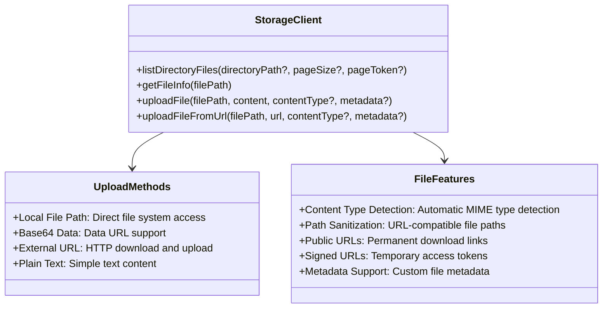
```mermaid
classDiagram
    class StorageClient {
        +listDirectoryFiles(directoryPath?, pageSize?, pageToken?)
        +getFileInfo(filePath)
        +uploadFile(filePath, content, contentType?, metadata?)
        +uploadFileFromUrl(filePath, url, contentType?, metadata?)
    }
    
    class UploadMethods {
        +Local File Path: Direct file system access
        +Base64 Data: Data URL support
        +External URL: HTTP download and upload
        +Plain Text: Simple text content
    }
    
    class FileFeatures {
        +Content Type Detection: Automatic MIME type detection
        +Path Sanitization: URL-compatible file paths
        +Public URLs: Permanent download links
        +Signed URLs: Temporary access tokens
        +Metadata Support: Custom file metadata
    }
    
    StorageClient --> UploadMethods
    StorageClient --> FileFeatures
```

#### Storage Features:
- **Multiple Upload Methods**: Local files, base64 data, external URLs, plain text
- **Content Type Detection**: Automatic MIME type detection from file extensions
- **Path Sanitization**: Converts file paths to URL-compatible formats
- **URL Generation**: Both permanent public URLs and temporary signed URLs
- **Error Handling**: Comprehensive error messages for common issues

### 3. Authentication Client (`src/lib/firebase/authClient.ts`)

User management and verification:

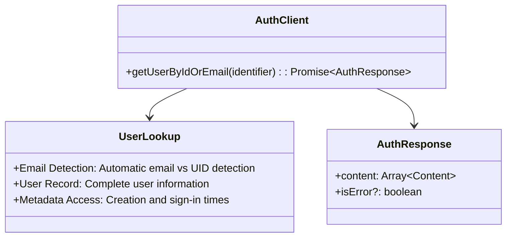
```mermaid
classDiagram
    class AuthClient {
        +getUserByIdOrEmail(identifier): Promise~AuthResponse~
    }
    
    class UserLookup {
        +Email Detection: Automatic email vs UID detection
        +User Record: Complete user information
        +Metadata Access: Creation and sign-in times
    }
    
    class AuthResponse {
        +content: Array~Content~
        +isError?: boolean
    }
    
    AuthClient --> UserLookup
    AuthClient --> AuthResponse
```

#### Authentication Features:
- **Flexible Lookup**: Supports both email addresses and user IDs
- **Complete User Data**: Returns full user records with metadata
- **Error Handling**: Graceful handling of non-existent users

## Tool Implementation

### Tool Architecture

The server implements 12 Firebase tools organized by service:


```mermaid
graph TD
    subgraph "Firestore Tools"
        A[firestore_add_document]
        B[firestore_list_documents]
        C[firestore_get_document]
        D[firestore_update_document]
        E[firestore_delete_document]
        F[firestore_list_collections]
        G[firestore_query_collection_group]
    end
    
    subgraph "Storage Tools"
        H[storage_list_files]
        I[storage_get_file_info]
        J[storage_upload]
        K[storage_upload_from_url]
    end
    
    subgraph "Authentication Tools"
        L[auth_get_user]
    end
    
    A --> M[Firebase Admin SDK]
    B --> M
    C --> M
    D --> M
    E --> M
    F --> M
    G --> M
    H --> M
    I --> M
    J --> M
    K --> M
    L --> M
```

### Tool Request Flow

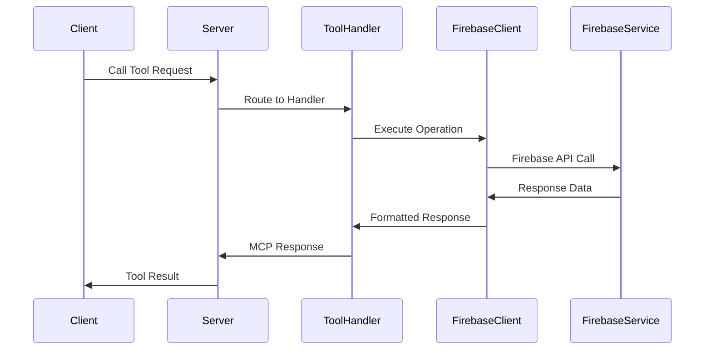
```mermaid
sequenceDiagram
    participant Client
    participant Server
    participant ToolHandler
    participant FirebaseClient
    participant FirebaseService
    
    Client->>Server: Call Tool Request
    Server->>ToolHandler: Route to Handler
    ToolHandler->>FirebaseClient: Execute Operation
    FirebaseClient->>FirebaseService: Firebase API Call
    FirebaseService->>FirebaseClient: Response Data
    FirebaseClient->>ToolHandler: Formatted Response
    ToolHandler->>Server: MCP Response
    Server->>Client: Tool Result
```

### Tool Response Formatting

All tools return standardized MCP responses:

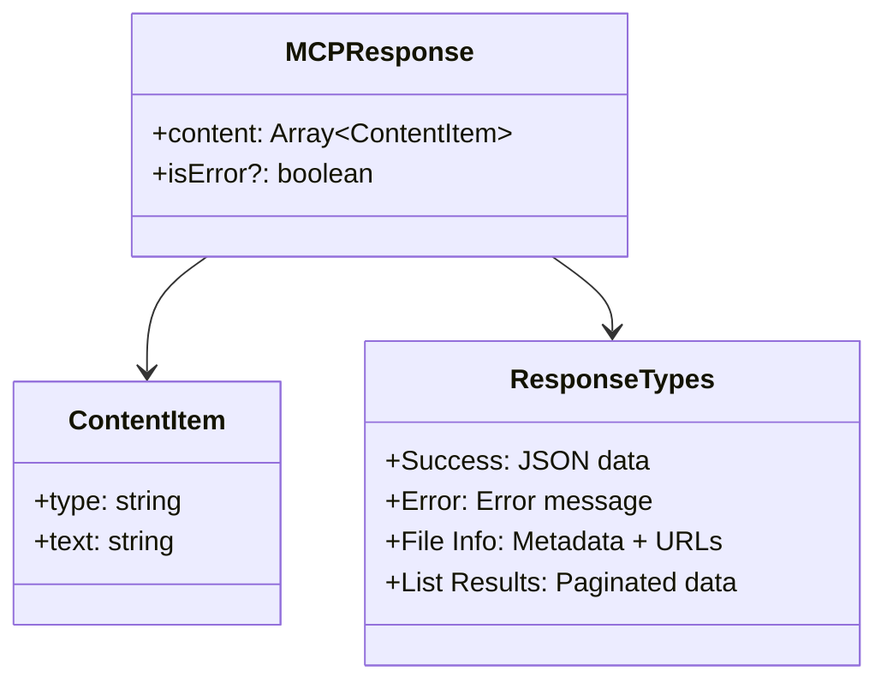
```mermaid
classDiagram
    class MCPResponse {
        +content: Array~ContentItem~
        +isError?: boolean
    }
    
    class ContentItem {
        +type: string
        +text: string
    }
    
    class ResponseTypes {
        +Success: JSON data
        +Error: Error message
        +File Info: Metadata + URLs
        +List Results: Paginated data
    }
    
    MCPResponse --> ContentItem
    MCPResponse --> ResponseTypes
```

## Data Flow

### Complete Request Lifecycle

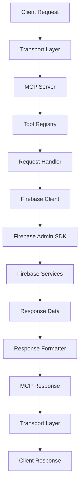
```mermaid
graph TD
    A[Client Request] --> B[Transport Layer]
    B --> C[MCP Server]
    C --> D[Tool Registry]
    D --> E[Request Handler]
    E --> F[Firebase Client]
    F --> G[Firebase Admin SDK]
    G --> H[Firebase Services]
    H --> I[Response Data]
    I --> J[Response Formatter]
    J --> K[MCP Response]
    K --> L[Transport Layer]
    L --> M[Client Response]
```

### Error Handling Flow

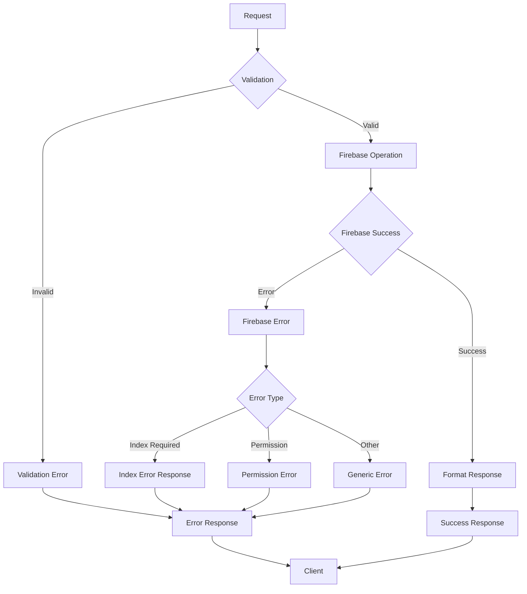
```mermaid
graph TD
    A[Request] --> B{Validation}
    B -->|Valid| C[Firebase Operation]
    B -->|Invalid| D[Validation Error]
    C --> E{Firebase Success}
    E -->|Success| F[Format Response]
    E -->|Error| G[Firebase Error]
    G --> H{Error Type}
    H -->|Index Required| I[Index Error Response]
    H -->|Permission| J[Permission Error]
    H -->|Other| K[Generic Error]
    D --> L[Error Response]
    I --> L
    J --> L
    K --> L
    F --> M[Success Response]
    L --> N[Client]
    M --> N
```

## Design Patterns

### 1. Strategy Pattern - Transport Selection

Different transport mechanisms are implemented as strategies:

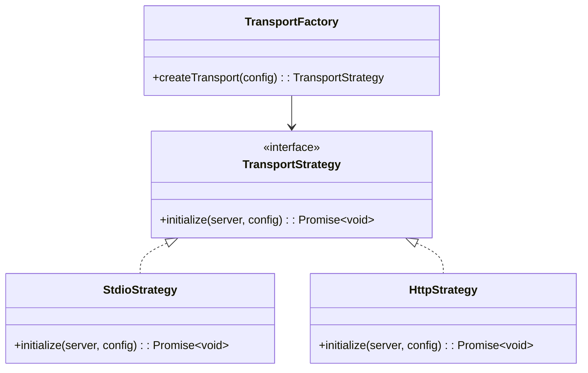
```mermaid
classDiagram
    class TransportStrategy {
        <<interface>>
        +initialize(server, config): Promise~void~
    }
    
    class StdioStrategy {
        +initialize(server, config): Promise~void~
    }
    
    class HttpStrategy {
        +initialize(server, config): Promise~void~
    }
    
    class TransportFactory {
        +createTransport(config): TransportStrategy
    }
    
    TransportStrategy <|.. StdioStrategy
    TransportStrategy <|.. HttpStrategy
    TransportFactory --> TransportStrategy
```

### 2. Adapter Pattern - Firebase Integration

Firebase Admin SDK is wrapped with MCP-compatible interfaces:

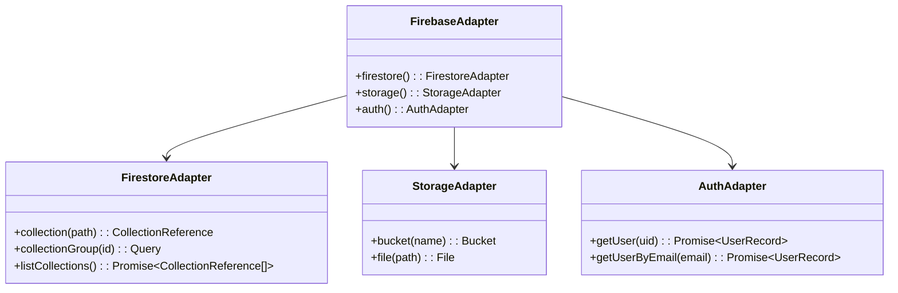
```mermaid
classDiagram
    class FirebaseAdapter {
        +firestore(): FirestoreAdapter
        +storage(): StorageAdapter
        +auth(): AuthAdapter
    }
    
    class FirestoreAdapter {
        +collection(path): CollectionReference
        +collectionGroup(id): Query
        +listCollections(): Promise~CollectionReference[]~
    }
    
    class StorageAdapter {
        +bucket(name): Bucket
        +file(path): File
    }
    
    class AuthAdapter {
        +getUser(uid): Promise~UserRecord~
        +getUserByEmail(email): Promise~UserRecord~
    }
    
    FirebaseAdapter --> FirestoreAdapter
    FirebaseAdapter --> StorageAdapter
    FirebaseAdapter --> AuthAdapter
```

### 3. Factory Pattern - Response Creation

Standardized response creation for all tools:

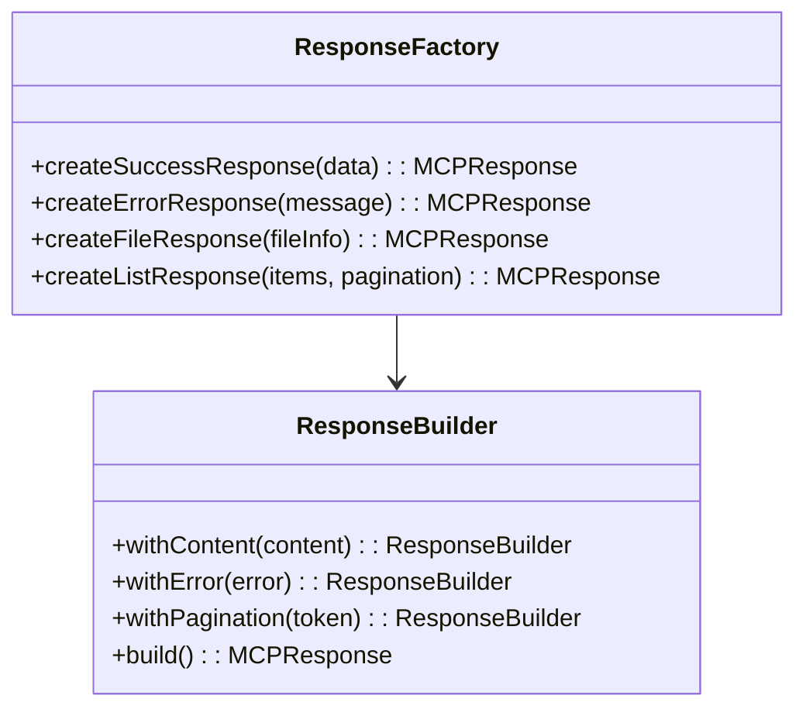
```mermaid
classDiagram
    class ResponseFactory {
        +createSuccessResponse(data): MCPResponse
        +createErrorResponse(message): MCPResponse
        +createFileResponse(fileInfo): MCPResponse
        +createListResponse(items, pagination): MCPResponse
    }
    
    class ResponseBuilder {
        +withContent(content): ResponseBuilder
        +withError(error): ResponseBuilder
        +withPagination(token): ResponseBuilder
        +build(): MCPResponse
    }
    
    ResponseFactory --> ResponseBuilder
```

### 4. Observer Pattern - Logging

Comprehensive logging system for debugging and monitoring:

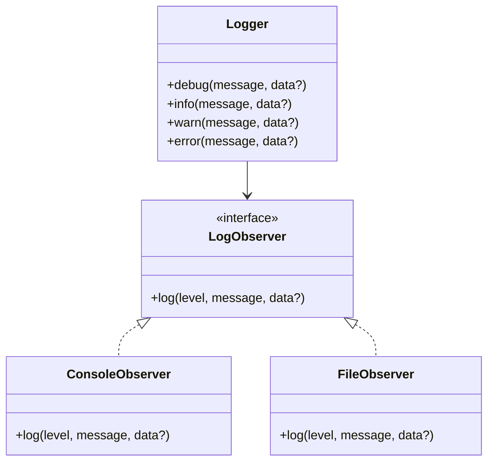
```mermaid
classDiagram
    class Logger {
        +debug(message, data?)
        +info(message, data?)
        +warn(message, data?)
        +error(message, data?)
    }
    
    class LogObserver {
        <<interface>>
        +log(level, message, data?)
    }
    
    class ConsoleObserver {
        +log(level, message, data?)
    }
    
    class FileObserver {
        +log(level, message, data?)
    }
    
    Logger --> LogObserver
    LogObserver <|.. ConsoleObserver
    LogObserver <|.. FileObserver
```

## Security & Error Handling

### Security Measures

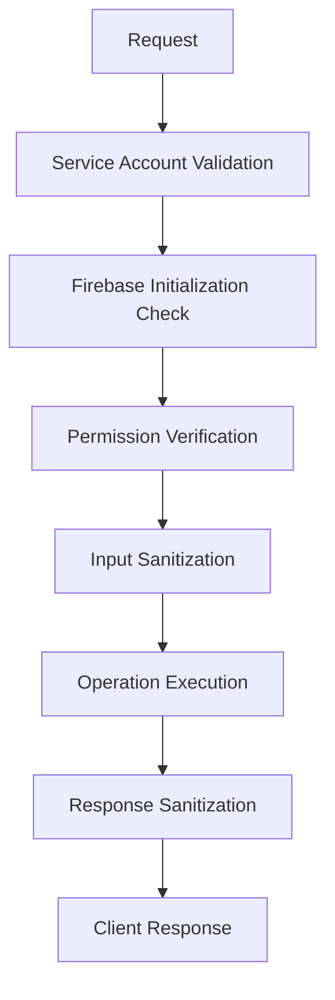
```mermaid
graph TD
    A[Request] --> B[Service Account Validation]
    B --> C[Firebase Initialization Check]
    C --> D[Permission Verification]
    D --> E[Input Sanitization]
    E --> F[Operation Execution]
    F --> G[Response Sanitization]
    G --> H[Client Response]
```

#### Security Features:
- **Service Account Authentication**: Uses Firebase service account keys
- **Input Validation**: Validates all tool parameters
- **Path Sanitization**: Sanitizes file paths for security
- **Error Message Sanitization**: Prevents information leakage
- **Permission Checks**: Leverages Firebase security rules

### Error Handling Strategy

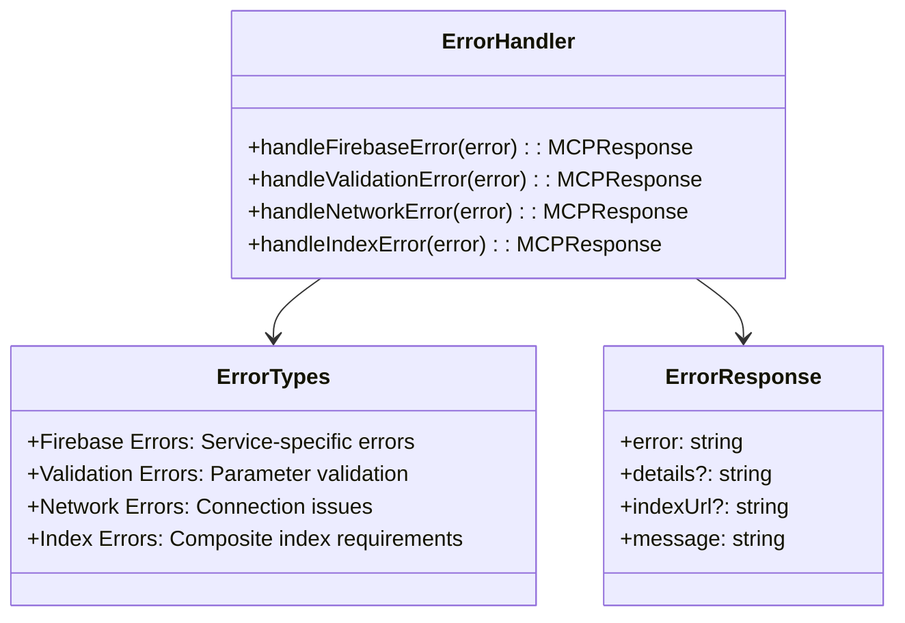
```mermaid
classDiagram
    class ErrorHandler {
        +handleFirebaseError(error): MCPResponse
        +handleValidationError(error): MCPResponse
        +handleNetworkError(error): MCPResponse
        +handleIndexError(error): MCPResponse
    }
    
    class ErrorTypes {
        +Firebase Errors: Service-specific errors
        +Validation Errors: Parameter validation
        +Network Errors: Connection issues
        +Index Errors: Composite index requirements
    }
    
    class ErrorResponse {
        +error: string
        +details?: string
        +indexUrl?: string
        +message: string
    }
    
    ErrorHandler --> ErrorTypes
    ErrorHandler --> ErrorResponse
```

#### Error Handling Features:
- **Firebase-Specific Errors**: Handles composite index requirements with console URLs
- **Graceful Degradation**: Continues operation when possible
- **Detailed Error Messages**: Provides actionable error information
- **Error Recovery**: Automatic retry for transient errors

## Testing Strategy

### Test Architecture

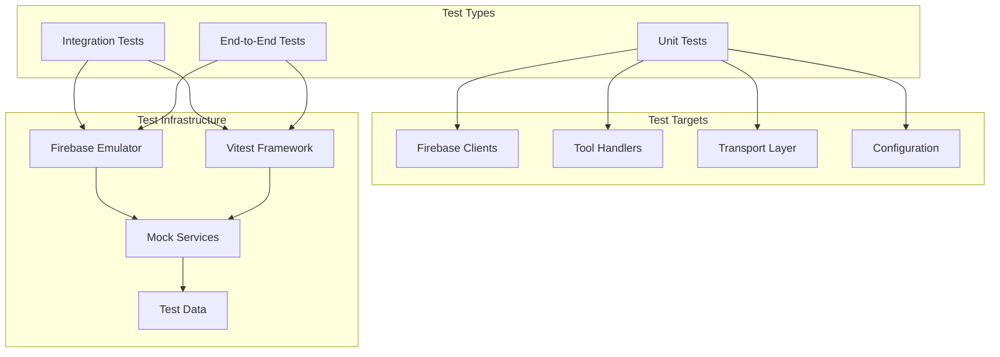
```mermaid
graph TD
    subgraph "Test Types"
        A[Unit Tests]
        B[Integration Tests]
        C[End-to-End Tests]
    end
    
    subgraph "Test Targets"
        D[Firebase Clients]
        E[Tool Handlers]
        F[Transport Layer]
        G[Configuration]
    end
    
    subgraph "Test Infrastructure"
        H[Firebase Emulator]
        I[Vitest Framework]
        J[Mock Services]
        K[Test Data]
    end
    
    A --> D
    A --> E
    A --> F
    A --> G
    
    B --> H
    B --> I
    
    C --> H
    C --> I
    
    H --> J
    I --> J
    J --> K
```

### Testing Features:
- **Firebase Emulator**: Uses Firebase emulators for testing
- **Comprehensive Coverage**: 80%+ test coverage requirement
- **Mock Services**: Isolated unit testing
- **Integration Testing**: End-to-end workflow testing
- **Error Scenario Testing**: Tests all error conditions

## Performance Considerations

### Optimization Strategies

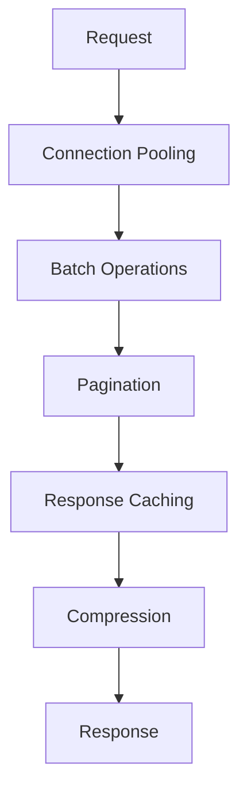
```mermaid
graph TD
    A[Request] --> B[Connection Pooling]
    B --> C[Batch Operations]
    C --> D[Pagination]
    D --> E[Response Caching]
    E --> F[Compression]
    F --> G[Response]
```

#### Performance Features:
- **Connection Pooling**: Reuses Firebase connections
- **Batch Operations**: Groups related operations
- **Pagination**: Limits result sets for large queries
- **Response Caching**: Caches frequently accessed data
- **Compression**: Compresses large responses

### Monitoring & Observability

```mermaid
classDiagram
    class Monitoring {
        +Request Metrics: Count, duration, errors
        +Firebase Metrics: API calls, latency
        +Resource Usage: Memory, CPU
        +Error Tracking: Error rates, types
    }
    
    class Logging {
        +Structured Logging: JSON format
        +Log Levels: Debug, info, warn, error
        +File Logging: Optional file output
        +Real-time Monitoring: Live log viewing
    }
    
    class Debugging {
        +MCP Inspector: Interactive debugging
        +Request Tracing: Full request lifecycle
        +Error Analysis: Detailed error information
    }
    
    Monitoring --> Logging
    Monitoring --> Debugging
```

## Extension Points

### 1. Custom Tools

Developers can add custom Firebase tools:

```typescript
// Example: Custom tool implementation
case 'custom_firebase_operation': {
  const result = await customFirebaseOperation(args);
  return {
    content: [{ type: 'text', text: JSON.stringify(result) }]
  };
}
```

### 2. Custom Transports

Additional transport mechanisms can be implemented:

```typescript
// Example: WebSocket transport
class WebSocketTransport implements TransportStrategy {
  async initialize(server: Server, config: ServerConfig): Promise<void> {
    // WebSocket implementation
  }
}
```

### 3. Custom Error Handlers

Specialized error handling for specific scenarios:

```typescript
// Example: Custom error handler
class CustomErrorHandler extends ErrorHandler {
  handleCustomError(error: CustomError): MCPResponse {
    // Custom error handling logic
  }
}
```

### 4. Custom Response Formatters

Specialized response formatting for specific tools:

```typescript
// Example: Custom response formatter
class CustomResponseFormatter {
  formatCustomResponse(data: any): MCPResponse {
    // Custom formatting logic
  }
}
```

## Deployment Architecture

### Production Deployment

```mermaid
graph TB
    subgraph "Production Environment"
        A[Load Balancer]
        B[Firebase MCP Server 1]
        C[Firebase MCP Server 2]
        D[Firebase MCP Server N]
    end
    
    subgraph "Firebase Services"
        E[Firestore]
        F[Storage]
        G[Authentication]
    end
    
    subgraph "Monitoring"
        H[Logging]
        I[Metrics]
        J[Alerts]
    end
    
    A --> B
    A --> C
    A --> D
    
    B --> E
    B --> F
    B --> G
    
    C --> E
    C --> F
    C --> G
    
    D --> E
    D --> F
    D --> G
    
    B --> H
    C --> H
    D --> H
    
    H --> I
    I --> J
```

### Docker Deployment

```dockerfile
# Example Dockerfile structure
FROM node:18-alpine
WORKDIR /app
COPY package*.json ./
RUN npm ci --only=production
COPY dist/ ./dist/
EXPOSE 3000
CMD ["node", "dist/index.js"]
```

## Conclusion

Firebase MCP provides a robust, scalable, and well-architected implementation of the Model Context Protocol for Firebase services. The modular design, comprehensive error handling, dual transport support, and extensive testing make it suitable for production use in AI assistant integrations.

### Key Architectural Strengths:
- **Modularity**: Clear separation of concerns across components
- **Flexibility**: Multiple transport options and deployment scenarios
- **Reliability**: Comprehensive error handling and recovery mechanisms
- **Scalability**: Support for multiple concurrent sessions and operations
- **Maintainability**: Well-structured code with extensive documentation
- **Testability**: Comprehensive test coverage with emulator support

This architecture enables developers to build sophisticated AI integrations with Firebase while maintaining clean, maintainable code and following best practices for both MCP and Firebase development.